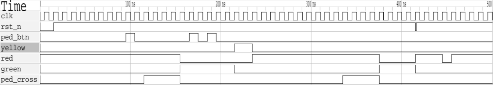

# Traffic Light Controller with Pedestrian Crossing Support

## Overview

This project implements a Traffic Light Controller (TLC) using synthesizable Verilog HDL. The controller regulates vehicle traffic using a finite state machine (FSM) while also supporting pedestrian crossing requests through a dedicated pedestrian push-button input.

The design models a simplified traffic intersection with configurable timing intervals for vehicle movement, transition phases, and pedestrian crossing periods. A pedestrian request mechanism ensures that crossing requests are serviced safely without disrupting the normal traffic sequence.

The controller was developed as a sequential digital design project to demonstrate finite state machine implementation, timer-based state transitions, asynchronous reset handling, and simulation-based verification.

---

# 1. Introduction

Traffic signal systems are widely used examples of finite state machine based control systems. Such controllers must coordinate multiple outputs while ensuring safe transitions between operating states.

A practical traffic controller must satisfy several requirements:

* Only one traffic signal should be active at a time.
* Traffic transitions must pass through a warning phase.
* Pedestrian requests should be acknowledged safely.
* Asynchronous reset conditions should return the system to a known state.
* Invalid state transitions must be prevented.

This project addresses these requirements using a Moore FSM architecture implemented in Verilog HDL.

---

# 2. Design Objectives

The primary objectives of the project were:

* Design a finite state machine based traffic controller.
* Support pedestrian crossing requests through a push-button input.
* Implement deterministic timing for each traffic phase.
* Ensure safe state transitions.
* Handle asynchronous reset conditions.
* Verify operation through simulation and waveform analysis.
* Develop a synthesizable design suitable for FPGA implementation.

---

# 3. System Description

The controller operates using the following inputs:

| Signal  | Description                   |
| ------- | ----------------------------- |
| clk     | System clock                  |
| rst_n   | Active-low asynchronous reset |
| ped_btn | Pedestrian request button     |

The controller generates the following outputs:

| Signal    | Description                |
| --------- | -------------------------- |
| green     | Vehicle green signal       |
| yellow    | Vehicle yellow signal      |
| red       | Vehicle red signal         |
| ped_cross | Pedestrian crossing signal |

The outputs are generated entirely from the current state of the FSM, making the design a Moore machine.

---

# 4. State Machine Architecture

The controller consists of four operational states:

## S_GREEN

Normal vehicle movement state.

Outputs:

* Green = 1
* Yellow = 0
* Red = 0
* Pedestrian Crossing = 0

Vehicles are allowed to proceed through the intersection.

The controller remains in this state until either:

* The programmed green interval expires, or
* A pending pedestrian request must be serviced.

---

## S_YELLOW

Transition state between vehicle movement and stop conditions.

Outputs:

* Green = 0
* Yellow = 1
* Red = 0
* Pedestrian Crossing = 0

This state provides a warning interval before traffic is halted.

---

## S_RED

Vehicle stop state.

Outputs:

* Green = 0
* Yellow = 0
* Red = 1
* Pedestrian Crossing = 0

Traffic is halted while the controller determines whether a pedestrian crossing phase is required.

---

## S_PED_WALK

Pedestrian crossing state.

Outputs:

* Green = 0
* Yellow = 0
* Red = 1
* Pedestrian Crossing = 1

Vehicle traffic remains stopped while pedestrians are permitted to cross.

After the crossing interval expires, the controller returns to the normal traffic sequence.

---

# 5. Pedestrian Request Handling

A dedicated pedestrian request mechanism is implemented to prevent loss of button presses.

Whenever a pedestrian presses the request button, a request flag is stored internally.

This request remains active until the controller enters the pedestrian crossing state.

Advantages of this approach include:

* No missed button presses.
* Deterministic servicing of requests.
* Improved user experience.
* Simplified state transition logic.

The request is automatically cleared after the crossing cycle has completed.

---

# 6. Timing Control

State durations are controlled using an internal counter.

The counter increments on each clock cycle and is reset whenever the FSM enters a new state.

The timer determines:

* Duration of vehicle green phase.
* Duration of yellow warning phase.
* Duration of red phase.
* Duration of pedestrian crossing phase.

Using a counter-based implementation allows timing values to be easily modified without changing the FSM architecture.

---

# 7. Moore FSM Implementation

The controller is implemented as a Moore finite state machine.

In a Moore machine:

* Outputs depend only on the current state.
* Outputs do not change directly in response to input transitions.
* Glitches are minimized.
* Verification becomes simpler.

This architecture is particularly suitable for traffic control systems where output stability is important.

---

# 8. Reset and Fault Recovery

An active-low asynchronous reset is implemented.

When reset is asserted:

* FSM returns to the default state.
* Internal counters are cleared.
* Pedestrian requests are cleared.
* Outputs return to a known safe condition.

This guarantees deterministic startup behavior and prevents undefined states after power-up.

---

# 9. Verification Methodology

A simulation-based verification strategy was used to validate controller behavior.

The testbench exercised:

* Initial reset conditions.
* Normal traffic operation.
* Pedestrian button activation.
* State transitions.
* Counter-based timing operation.
* Multiple pedestrian requests.
* Recovery after reset.

Verification focused on ensuring that every state transition occurred at the correct time and produced the expected outputs.

---

# 10. Simulation Results

Simulation waveforms demonstrate successful controller operation.

The waveform confirms:

* Correct reset behavior.
* Proper green-to-yellow transition.
* Correct yellow-to-red transition.
* Successful pedestrian request detection.
* Activation of pedestrian crossing phase.
* Safe return to normal traffic operation.

When the pedestrian button is asserted, the controller stores the request and later enters the pedestrian crossing state after completing the required traffic sequence.

The waveform also confirms that:

* Vehicle traffic is halted during pedestrian crossing.
* Red signal remains active while pedestrians cross.
* Pedestrian crossing signal is asserted only during the designated crossing interval.

No illegal output combinations were observed during simulation.

---

# 11. RTL Structure

RTL synthesis confirms that the design consists primarily of:

* State registers
* Counter registers
* Transition logic
* Output decoding logic
* Pedestrian request storage

The synthesized RTL representation matches the intended FSM architecture and demonstrates successful conversion of the behavioral Verilog description into digital hardware.

---

# 12. Future Improvements

Potential extensions include:

* Multi-direction traffic control.
* Independent left-turn signals.
* Emergency vehicle priority handling.
* Adaptive timing based on traffic density.
* Sensor-based traffic monitoring.
* Countdown displays for pedestrians.
* FPGA implementation on development boards.

These additions would allow the controller to model a more realistic urban traffic intersection.

---

# 13. Conclusion

A Traffic Light Controller with pedestrian crossing support was successfully designed and verified using Verilog HDL.

The controller employs a Moore finite state machine architecture, counter-based timing control, and a pedestrian request management mechanism to safely coordinate vehicle and pedestrian movement. Simulation results verified correct state sequencing, reset operation, pedestrian request servicing, and output generation.

The design demonstrates fundamental digital system concepts including finite state machines, sequential logic design, timing control, and verification methodology, making it a suitable FPGA-based control systems project.
